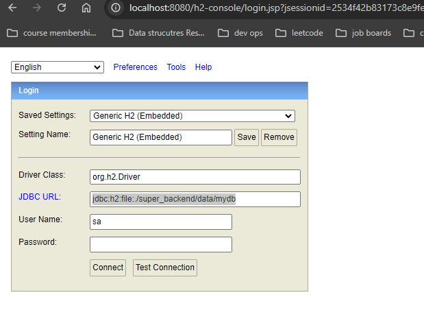
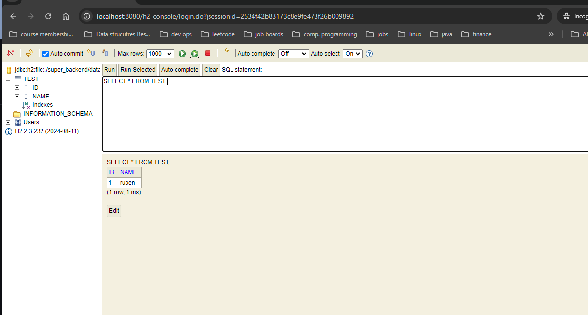

## How to get started

### Prerequisites
- Docker Desktop https://docs.docker.com/desktop/
- java version: 21 (https://www.geeksforgeeks.org/download-install-java-windows-linux-macos/). Make sure you also install the `JAVA_HOME` variable discussed in the link. For more info about `JAVA_HOME` use https://www.baeldung.com/java-home-on-windows-mac-os-x-linux
- ide. For backend development, IntelliJ is recommend. It has a free community version. https://www.jetbrains.com/idea/download/?section=windows No ide is needed when you are only running the backend to work on the frontend. The instructions below are all in the terminal.

### Running application
- go to `super_backend` dir in the terminal
- Run in terminal `docker compose up -d` to start up docker container with postgres database
- Run the following command in the terminal `.\mvnw.cmd spring-boot:run` to start up the backend
  - Windows: `.\mvnw.cmd spring-boot:run`
  - Mac/Linux `./mvnw spring-boot:run`. It could be that you have to run `chmod +x mvnw` before you can run `spring-boot:run`

### Shutting down application
- In the terminal use `ctrl+c` to shut down the application
- Run `docker compose down --volumes` to shut down the database

## Swagger

You can go to http://localhost:8080/swagger-ui.html to view the open api definition provided by swagger while running the application


## to use h2 db to persist while we setup postgres
I added a h2 db to get started persisting and building out your services. Meanwhile we decide where to host our postgres db and backend.
find more info here: https://www.h2database.com/html/main.html , https://howtodoinjava.com/spring-boot/h2-database-example/
after running the spring boot app in 

```src/main/java/com/example/demo/AppApplication.java```

go ahead and run it. once it finished. go ahead to 

``http://localhost:8080/h2-console`` (assuming hosted on port 8080)
you should see: 


and use:
the saved setting: Generic H2 (Embedded)

setting name: Generic H2(Embedded)

driver class: org.h2.Driver

jdbc url: jdbc:h2:file:./super_backend/data/mydb

username: sa

password:

password is a blank space*  

screen should be like this

once you logged in this should be what you see. 

